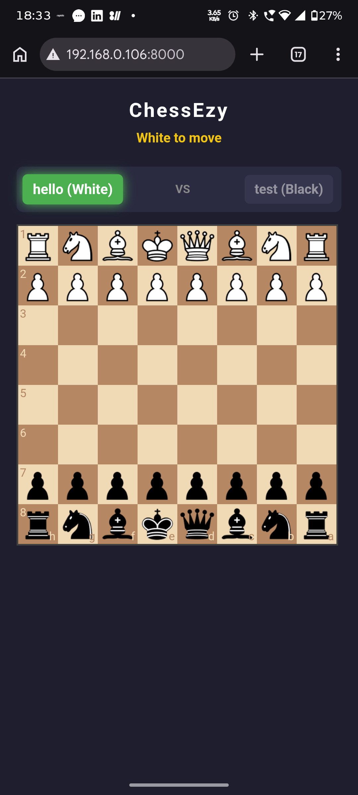

# ChessEzy ♟️


**ChessEzy** is a lightning-fast ⚡, zero-setup local multiplayer and vs-AI 🤖 chess game ♟️. Run the server, scan the automatically generated QR code with your smartphone, and instantly play chess against anyone on your local Wi-Fi network 🛜, or practice solo against the built-in Python bot.

No account creation, no external servers, just pure chess over WebSockets.

## ✨ Features

- **Two Game Modes:** Choose between 👥 **Play vs Human (LAN)** for local multiplayer or 🤖 **Play vs AI (Bot)** for solo practice.
- **Instant Matchmaking:** Scan the QR code to join. The server automatically groups multiplayer users into 2-person rooms (White and Black).
- **Real-Time WebSockets:** Powered by FastAPI for incredibly fast, bidirectional move broadcasting with zero latency.
- **Auto-LAN Discovery:** Automatically resolves your machine's local IPv4 address and generates a scannable QR code on server startup.
- **Smart UI:** - Responsive design that works perfectly on both desktop browsers and mobile devices.
  - Highlights legal moves when a piece is selected.
  - Dynamic player turn indicators and check/checkmate detection.
- **Fully Validated Logic:** Enforces all standard chess rules (turns, legal moves, check, checkmate, draws) via `python-chess` on the backend and `chess.js` on the frontend.

## 📸 Screenshots


_Starting server on terminal._


_Server automatically generates a local network URL and QR code._


_Dark mode UI with dynamic turn highlighting and legal move indicators._


_Fully responsive mobile view._

## 🛠️ Tech Stack

- **Backend:** Python, FastAPI, Uvicorn, WebSockets
- **Network Utils:** `socket`, `qrcode[pil]`
- **Frontend:** HTML/CSS/JavaScript (Vanilla)
- **Chess Engines:** \* [Chessboard.js](https://chessboardjs.com/) (UI & piece rendering)
  - [Chess.js](https://github.com/jhlywa/chess.js) (Move validation logic)

## 📂 Project Structure

```text
CHESSEZY/
├── env/                # Python Virtual Environment
├── static/             # Frontend Assets
│   ├── css/
│   │   └── style.css   # Dark-mode styling and UI animations
│   └── js/
│       └── game.js     # WebSocket connections and board logic
├── templates/
│   └── index.html      # Main game view
├── main.py             # FastAPI server and WebSocket room manager
└── requirements.txt               # Requirements file
```

## 🚀 Installation & Setup

1. **Clone the repository:**

   ```bash
   git clone https://github.com/RinRyuu/ChessEzy.git
   cd ChessEzy
   ```

2. **Create and activate a virtual environment:**

   ```bash
   # Windows
   python -m venv env
   env\Scripts\activate

   # macOS/Linux
   python3 -m venv env
   source env/bin/activate
   ```

3. **Install dependencies:**
   ```bash
   pip install -r requirements.txt
   ```
   _(Note: Ensure your `requirements.txt` includes `fastapi`, `uvicorn`, `websockets`, `chess`, and `qrcode[pil]`)_

## 🎮 How to Play

1. Start the FastAPI server:
   ```bash
   python main.py
   ```
2. A QR code will automatically pop up on your computer screen.
3. **Player 1:** Scan the QR code with a smartphone (or open the local IP link on a browser) to join the room as White. Enter your name when prompted.
4. **Player 2:** Scan the same QR code to join as Black.
5. The board will unlock, and the game begins. When a room is full, the next person to scan the code will automatically be placed in a new, empty room.
6. Select your Game Mode:

   **Play vs AI:** Instantly start a match against the built-in Python bot. You will be assigned the White pieces.

   **Play vs Human:** You will be placed in a waiting room. Have a second player scan the QR code to join your room, and the game will begin automatically!

_Note: Ensure the devices you are using to play are connected to the same Wi-Fi network as the host machine._

## 🤝 Contributing

Pull requests are welcome! If you want to add features like a chatbox, move history, or custom piece themes, feel free to fork the repository and submit a PR.

## 📄 License

This project is licensed under the MIT License.
